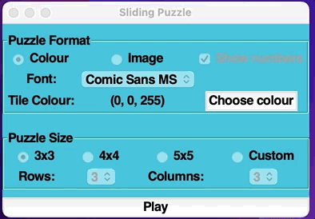
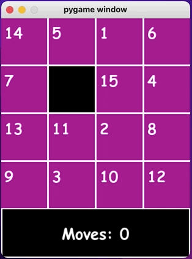
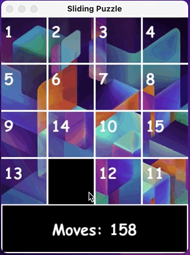

# Sliding Puzzle

This is a 2D sliding puzzle game programmed in Python. It includes a GUI made using the module pygame as well as a console based version. This game has the option of importing an image to use as the tiles or just numbers and colours


## Run Locally

Clone the project

```bash
  git clone https://github.com/ckasina/slidingpuzzle.git
```

Go to the project directory

```bash
  cd slidingpuzzle
```

Install dependencies

```bash
  python3 -m venv env
  python -m pip install -r requirements.txt
```

Start the program

```bash
  python main.py
```


## License

*NOT FOR COMMERCIAL USE*: If you have the intention of using all / any portion of my code for commerical use please contact me and request permission

## Screenshots

Options Menu


Shuffling the puzzle


Winning the game

